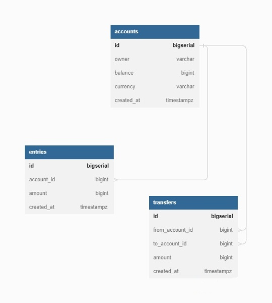

# Complete Bank Application

This repository will be include complete bank application with all of the necessary dependencies. ( Migrations, Transactions etc. )

# Structure of application

- [Introduction](#introduction)
- [Quick start](#getting-started)
  - [DB Schema](#db-schema)
  - [Features](#features)
- [TODOS](#todos)

# Introduction

This application will be built with an advanced way for golang using postgres. It will be a complete bank application for users. This repository is useful for who have a bit knowledge on golang and improve self with to an advanced level on that programming language and web development. This application includes lot's of good dependencies for mid knowledge developers.

# Getting Started

# DB Schema
</img>

# Features

You can see all of the features that i used in this application;

- Transactions
- DB Migrations
- DB connection with Postgres ( in the future, i will implement MongoDB and MySQL too )
- Docker
- Makefile ( docker commands implemented too )
- CI/CD implementation
- SQLC
- Testify library for tests
- Well architecture
- Configuration via using Viper
- Deadlock solvings

# TODOS

- Mock tests
- Mock DB
- Kubernetes
- Jenkins for prenv,staging and prod
- All of the api's for finish the application
- More migrations will be implement
- CI/CD will be the best for application